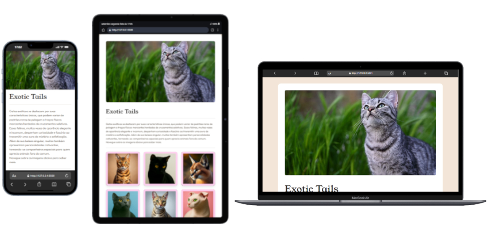

# Exotic Tails 🐾

Uma landing page elegante e responsiva dedicada ao fascinante mundo dos gatos exóticos. O projeto apresenta uma galeria de imagens interativas que é carregada dinamicamente, proporcionando uma experiência de usuário fluida e agradável.



Visite em: https://projeto-gatos-exoticos.vercel.app/

---

## ✨ Funcionalidades

- **Design Responsivo:** Interface totalmente adaptável para uma visualização perfeita em desktops, tablets e celulares.
- **Galeria Dinâmica:** As imagens e informações dos gatos são carregadas de forma assíncrona a partir de um arquivo JSON, sem a necessidade de recarregar a página.
- **Efeitos de Hover Interativos:** Animações suaves ao passar o mouse sobre as imagens, revelando informações sobre cada felino e melhorando a interatividade.
- **Estrutura Semântica:** O código HTML é bem estruturado, o que melhora a acessibilidade e o SEO.

---

## 🚀 Tecnologias Utilizadas

O projeto foi construído utilizando tecnologias web modernas para garantir performance e uma ótima experiência de desenvolvimento.

- **HTML5:** Utilizado para a marcação e estrutura semântica do conteúdo.
- **Tailwind CSS:** Um framework CSS utility-first que permitiu a criação de um design customizado e responsivo de forma ágil.
- **JavaScript (ES6+):** Responsável pela interatividade e pela lógica de carregamento dinâmico dos dados da galeria.
- **Fetch API:** Usada para fazer a requisição assíncrona ao arquivo `images.json` que contém os dados sobre os gatos.
- **Google Fonts:** Para a importação das fontes `Outfit` e `Young Serif`, que definem a identidade visual do site.

---

## 🔧 Como Executar o Projeto Localmente

Como o projeto utiliza a `Fetch API` para carregar dados locais, ele precisa ser executado a partir de um servidor web para funcionar corretamente (abrir o `index.html` diretamente no navegador pode gerar um erro de CORS).

1.  **Clone o repositório:**

    ```bash
    git clone https://github.com/Alexmacol/projeto-gatos-exoticos.git
    ```

    _(Substitua `Alexmacol` pelo seu nome de usuário do GitHub, se necessário)_

2.  **Navegue até a pasta do projeto:**

    ```bash
    cd projeto-gatos-exoticos
    ```

3.  **Instale as dependências:**

    ```bash
    npm install
    ```

4.  **Inicie um servidor local:**
    A maneira mais fácil é usar a extensão **Live Server** no Visual Studio Code. Com ela instalada, basta clicar com o botão direito no arquivo `index.html` e selecionar "Open with Live Server".

5.  Acesse o endereço fornecido pelo Live Server (geralmente `http://127.0.0.1:5500`) no seu navegador.

---

## 🚀 Deploy

O deploy deste projeto é feito de forma contínua na Vercel. Cada `push` para a branch `main` dispara um novo build e deploy automaticamente.

---

Feito por ❤️ aos gatos por Alexmacol.
